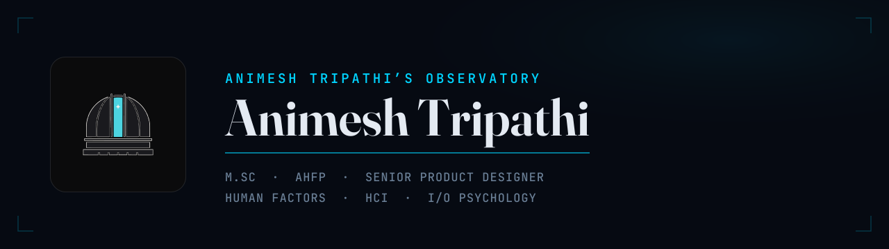

<!-- Masthead + badges are generated from the Observatory design system.
     Regenerate: cd assets && python build.py  (outlines brand fonts → vector paths
     so type renders identically inside GitHub-served SVGs). -->

<a href="https://animeshdesigns.com">
  <picture>
    <source media="(prefers-color-scheme: dark)" srcset="assets/masthead-dark.svg">
    <source media="(prefers-color-scheme: light)" srcset="assets/masthead-light.svg">
    
  </picture>
</a>

  
  &nbsp;
  
  &nbsp;
  

---

Senior Product Designer working in Human-Computer Interaction and
Industrial-Organizational Psychology, on a Human Factors Engineering foundation
(M.Sc, AHFP). Work sits in the gap between how things get designed and how real
people actually use them.

This profile holds the build infrastructure behind
[animeshdesigns.com](https://animeshdesigns.com): the live site source and the
Observatory design system it consumes. Writing lives on the site.

**Public here.** The live Observatory site source and the design system.
**Not public.** Portfolio studies under NDA, client deliverables, and
proprietary research.

Older code lives on the [animeshUX](https://github.com/animeshUX) profile.
